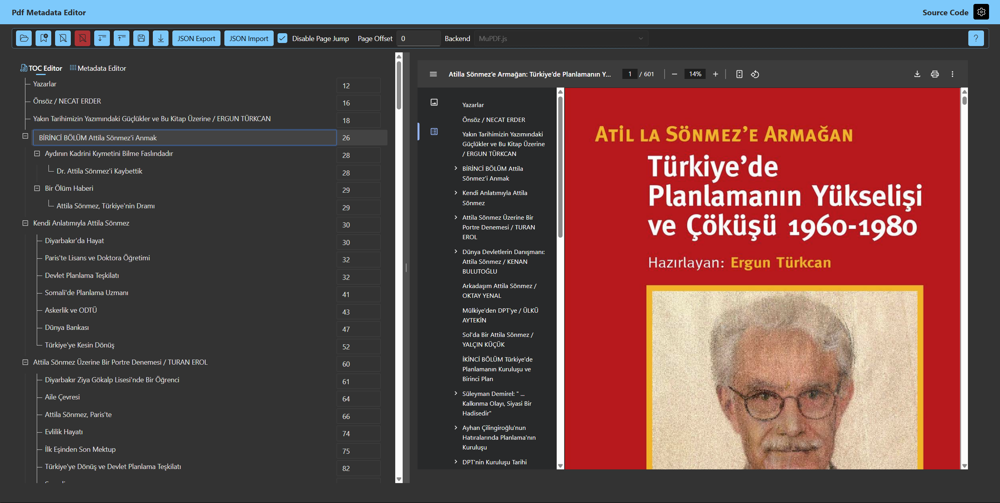

# PdfMetadataEditor

Simple Blazor WebAssembly App to Edit PDF Metadata

The app consists of two tabs: TOC Editor and Metadata Editor

## Table of Contents Editor

- In the TOC (Table of Contents) (or Outline) Editor user can either edit the existing outline or create one from scratch.
- New nodes at any level can be created, shifted under any other node. Simply drag and drop tree nodes in order to change the outline.
- Nodes can be removed.
- Every node's title and destination page can be altered. Doube click on the title text to enter edit mode, Press Esc or Ctrl+Enter to exit.

## Metadata Editor

- Title, Author, Subject, Keywords, Creator and Producer metadata fields can be edited.

Available at: https://anezih.github.io/PdfMetadataEditor

# Screenshots

# Credits

[Fluent UI Blazor](https://www.fluentui-blazor.net/)

[Ant Design Blazor](https://antblazor.com/en-US/)

[iText7](https://github.com/itext/itext-dotnet)

[PdfSharpCore](https://github.com/ststeiger/PdfSharpCore)

[Blazor.FileAPI](https://github.com/KristofferStrube/Blazor.FileAPI)

[PublishSPAforGitHubPages.Build](https://github.com/jsakamoto/PublishSPAforGitHubPages.Build)