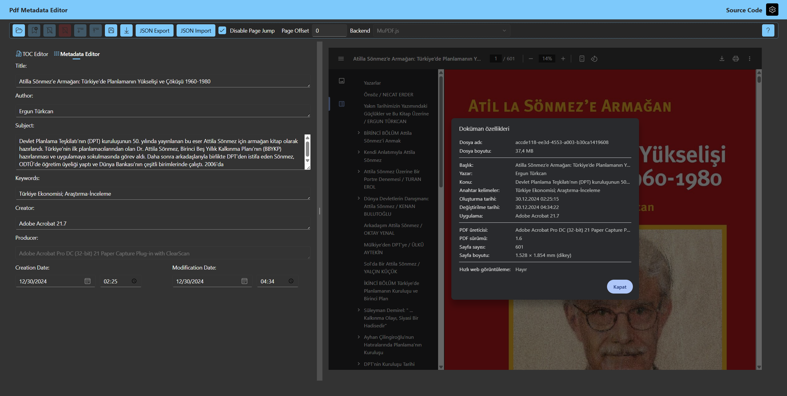

# PdfMetadataEditor

Simple Blazor WebAssembly App to Edit PDF Metadata

Available at: https://anezih.github.io/PdfMetadataEditor

# Screenshots

# Credits

[Fluent UI Blazor](https://www.fluentui-blazor.net/)

[Ant Design Blazor](https://antblazor.com/en-US/)

[iText7](https://github.com/itext/itext-dotnet)

[Blazor.FileAPI](https://github.com/KristofferStrube/Blazor.FileAPI)

[PublishSPAforGitHubPages.Build](https://github.com/jsakamoto/PublishSPAforGitHubPages.Build)